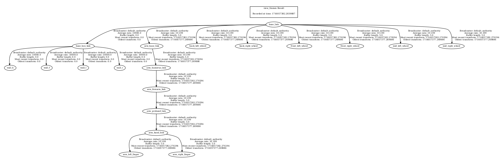
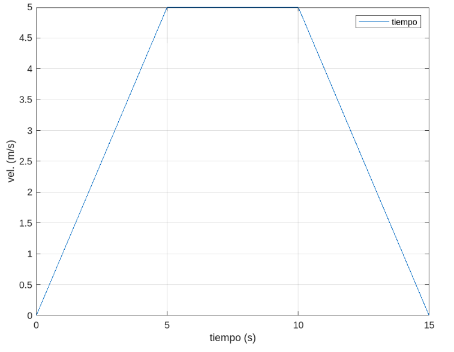

# robot_desc_py - Modelado y Simulación de Robots

## Descripción

Este repositorio contiene la configuración de un robot modelado en Blender para ser utilizado y controlado en ROS2, cumpliendo con los requisitos de la práctica 3 de la asignatura de Modelado y Simulación en Robótica.
- **Fase A**: traslado del modelo URDF del robot de la práctica previa a un paquete de ros2, publicación de sus TFs y visualización del mismo en Rviz2: completamente finalizada
- **Fase B**: simulación en dos entornos de gazebo diferentes usando el mismo robot para estudiar el comportamiento del mismo y su modelo de colisión en mundos distintos: no completamente terminada por falta de tiempo.

## Estructura principal del Repositorio

- `robot_desc_py/`
  - `launch/`: Archivos de lanzamiento para pruebas y visualización.
  - `meshes/`: Modelos 3D utilizados en el URDF.
  - `models/`: Modelos utilizados por los mundos de gazebo en la fase B.
  - `nodes/`: Nodos de ros2 complementarios desarrollados (speed_controller entre ellos).
  - `sensors/`: Modelos de URDF XACRO empleados para definir macros de los sensores del robot (cámara e IMU).
  - `urdf/`: Modelos URDF / XACRO del robot.
  - `worlds/`: Archivos de mundos usados en las simulaciones de gazebo.

---

## FASE A:

### Lanzar la Prueba de Publicación de Información del Robot

La información del robot y su configuración con el brazo mecánico se puede visualizar en el topic /robot_description de la siguiente manera:

1. Lanzar en un terminal:

```
cd <workspace>
ros2 run robot_state_publisher robot_state_publisher src/robot_desc_py/urdf/robot.urdf.xacro
```
2. En otro terminal ejecutar el siguiente comando:
```
ros2 topic echo /robot_description
```

### Visualizar el Robot en RViz

Para visualizar el robot en RViz, he desarrollado un launcher diferente que el proporcionado para la misma práctica por tener reiterados errores con el mismo. Se lanza de la siguiente manera:

```
cd <workspace>
colcon build --symlink-install --cmake-args -DBUILD_TESTING=OFF
ros2 launch robot_desc_py rob_disp.launch.py
```
Añadiendo en Rviz las TFs y el modelo del robot (publicado también con el launcher en el topic /robot_description) podemos observar la configuración del robot.

### Diagrama de Árbol de TF

El diagrama de árbol de TF del robot se encuentra en el archivo `docs/frames_with_arm.pdf` en el directorio /docs dentro del raíz de este paquete.



---

## Fase B: Integración y Estudio de Dinámicas en Gazebo y ROS2

### Objetivo

Simular el comportamiento del robot y su modelo de colisión en dos entornos de Gazebo diferentes, estudiando su comportamiento dinámico.

### Partes completadas con éxito:

- **Publicación de Información del Robot**: Publicación de la configuración del robot en el topic `/robot_description`.
- **Nodo `speed_controller`**: Desarrollo del nodo `speed_controller` que publica velocidades según una gráfica específica.
- **Lanzamiento del Robot en Gazebo**:
  - **Entorno `sand.world`**: Simulación del robot en el mundo `sand.world`. El robot presenta comportamientos erróneos pero se logra la simulación de colisiones solicitada.
  - **Entorno `floor.world`**: No se ha logrado lanzar el robot en este entorno debido a problemas no identificados.

### Lanzamiento de las distintas partes:

#### Publicación de la Información del Robot

Se realiza de manera casi idéntica a la fase A, pero empleando esta vez el URDF modificado que no contiene el brazo mecánico inicial:
```
cd <workspace>
ros2 run robot_state_publisher robot_state_publisher src/robot_desc_py/urdf/rover.urdf.xacro
```
Se puede visualizar la información publicada del mismo modo que anteriormente:
```
ros2 topic echo /robot_description
```

#### Publicación de Velocidades para el Robot:

El nodo speed_controller desarrollado se puede ejecutar de la siguiente manera:
```
ros2 run robot_desc_py speed_controller
```
El propio nodo debería ir mostrando en la misma terminal en que se haya lanzado las velocidades que va publicando las cuales resultarían en una gráfica muy cercana a la solicitada:



#### Simulación de prueba de colisiones en gazebo:

Para lanzar el robot en el entorno `sand.world`, utiliza el siguiente comando:

```
ros2 launch robot_desc_py gazebo_rover2.launch.py
```

**Nota**: El robot aparece deslizándose y presenta comportamientos erróneos, pero se ha logrado la simulación de colisiones.

También es posible lanzar el robot en un mundo vacío en el cual se comporta de manera físicamente adecuada con el siguiente comando:
```
ros2 launch robot_desc_py gazebo_rover.launch.py
```

## Consideraciones Finales

Este proyecto se realizó como parte de una práctica universitaria y se encuentra aún en desarrollo.

## Contacto

- Moisés Muñoz Suárez
- Email: [m.munozs.2020@alumnos.urjc.es](mailto:m.munozs.2020@alumnos.urjc.es)
- [URJC]

---